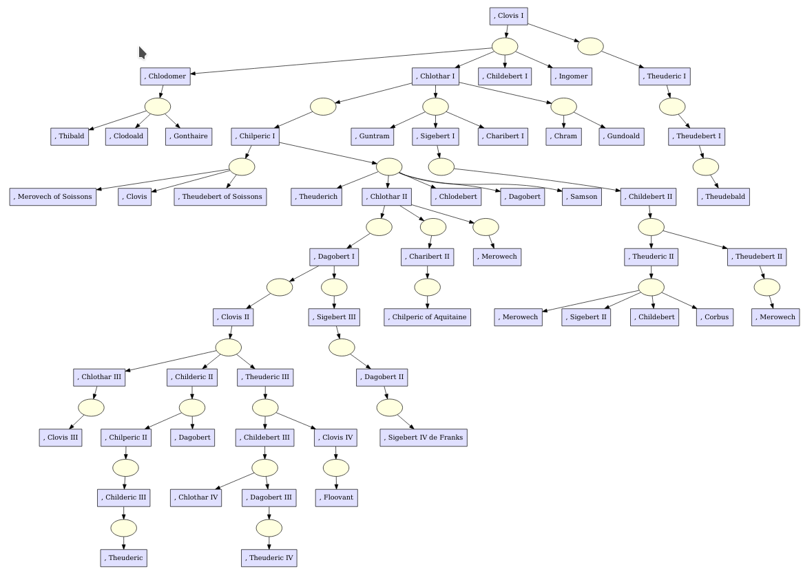
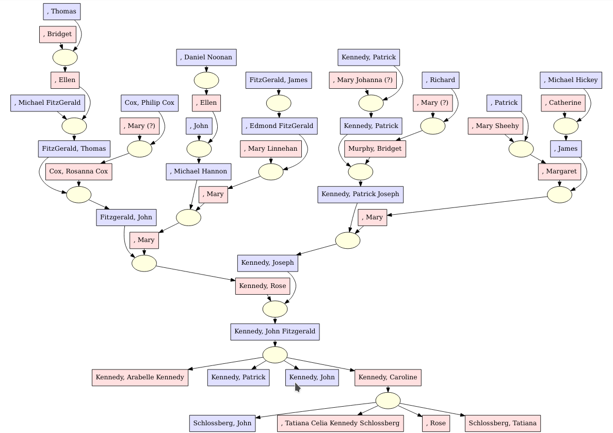
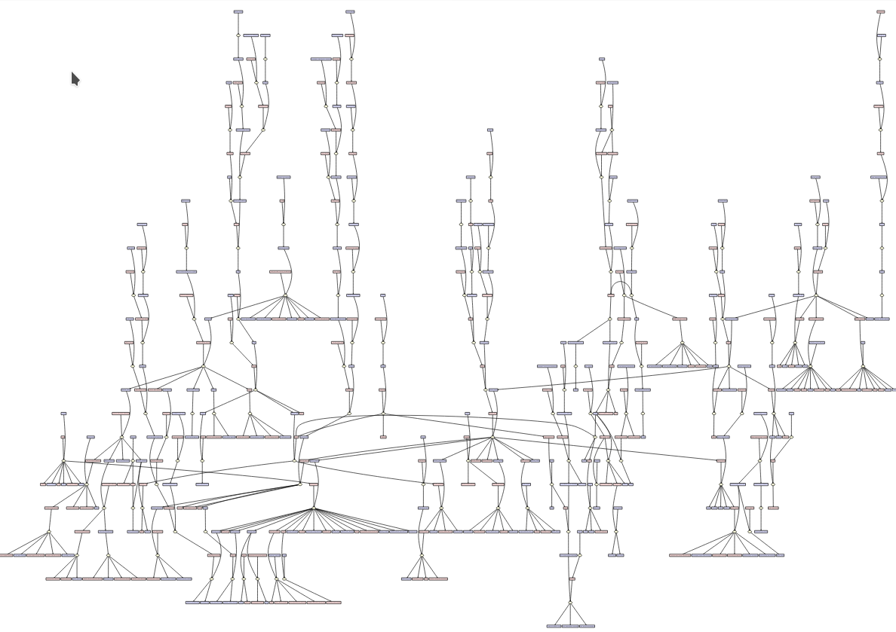

# Wikidata Tree Generarator

### Requirements

This project has been realized with python 3.8.

Install dependencies : `python3 -m pip install -r requirements.txt`

### Usage
    
```python3 main.py {{configuration file}} {{wikidata entity id}} {{output file}}```

* For configuration file see : https://github.com/lmallez/wikidata-tree-generator/blob/master/configuration.dist.yaml
* To find the wikidata id of a character you have to go to https://www.wikidata.org, search for the character in question and select its ID (the ID starts with a Q and can be found in the url and to the right of the character's name).


### Explanations

In order to generate a family tree the program uses the [mother](https://www.wikidata.org/wiki/Property:P25), [father](https://www.wikidata.org/wiki/Property:P22) and [child](https://www.wikidata.org/wiki/Property:P40) properties of wikidata.

The tree can be generated in different ways:
- Ancestors : load the ancestors of the character.
- Descendants: charges the character's descendants
- Classic : loads the ancestors and descendants of the character
- Full: Loads parents and children with all the characters in the tree (can take a long time)

### Examples

*All the graphs shown here are generated in the gramps software which allows to import the gedcom made by the program.*

##### Clovis (descendants & load_men_children)

```python3 main.py samples/Q82339.configuration.yaml Q82339 samples/Q82339.ged```

[Configuration](samples/Q823339.configuration.yaml)
[Output](samples/Q823339.ged)



##### John F. Kennedy (classic)

```python3 main.py samples/Q9696.1.configuration.yaml Q9696 samples/Q9696.1.ged```

[Configuration](samples/Q9696.1.configuration.yaml)
[Output](samples/Q9696.1.ged)



##### John F. Kennedy (full)

```python3 main.py samples/Q9696.2.configuration.yaml Q9696 samples/Q9696.2.ged```

[Configuration](samples/Q9696.2.configuration.yaml)
[Output](samples/Q9696.2.ged)




### TODO

* error management
* add more character properties
* add more event (wedding)
* add references
